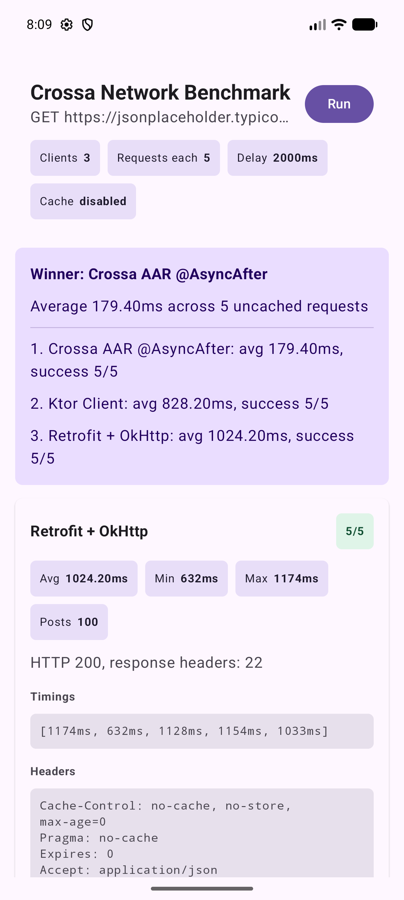

# android-example

Android network comparison demo for the same request:

```text
GET https://jsonplaceholder.typicode.com/posts
```

The app has one screen with three scenarios:

- Retrofit + OkHttp interceptor headers and response metadata.
- Ktor client with coroutines.
- Crossa `.cra` + `config.cra` generated into an Android `.aar`, linked by the demo app, and called through the generated `@AsyncAfter` callback API.

Each scenario runs 5 requests with a 2000ms delay. The screen shows success count, total time, average time, min/max, mapped post count, the first mapped post, request headers, and response preview.
After all three results are available, the Activity prints the average milliseconds for each scenario and marks the fastest successful 5/5 run as the winner.

## Verify

```sh
./scripts/generate-crossa-aar.sh
./gradlew verifyDemo
```

The script calls the Crossa CLI, builds `library-debug.aar`, and copies it to `app/libs/crossa-generated-debug.aar`. `verifyDemo` runs the same generation through the `generateCrossaAar` Gradle task before building the APK.

Android Studio Run does not generate the AAR. Run `./scripts/generate-crossa-aar.sh` after changing `.cra` sources, then run the app from Android Studio.

## Latest run (2026-09-06)

Rebuilt after fixing `Unable to configure native HTTP transport option`. Android’s generated libcurl is built without nghttp2, so `CURLOPT_HTTP_VERSION_2TLS` is now attempted and then falls back to HTTP/1.1.

Pixel 10 Pro emulator (`arm64-v8a`, API 37). Each client sent 5 uncached `GET https://jsonplaceholder.typicode.com/posts` requests with a 2000ms delay. Crossa completed all 5 requests with HTTP 200.

| Rank | Client | Average | Success | Notes |
|---|---|---|---|---|
| 1 | **Crossa AAR `@AsyncAfter`** | **179.40 ms** | 5/5 | Winner |
| 2 | Ktor Client | 828.20 ms | 5/5 | |
| 3 | Retrofit + OkHttp | 1024.20 ms | 5/5 | min 632 ms, max 1174 ms |

**Crossa still wins on Android.** After the transport-option fix, the native AAR was about 4.6× faster than Ktor and 5.7× faster than Retrofit on this emulator run. These are raw in-app timings from repository call to a parsed result, not a formal benchmark.


